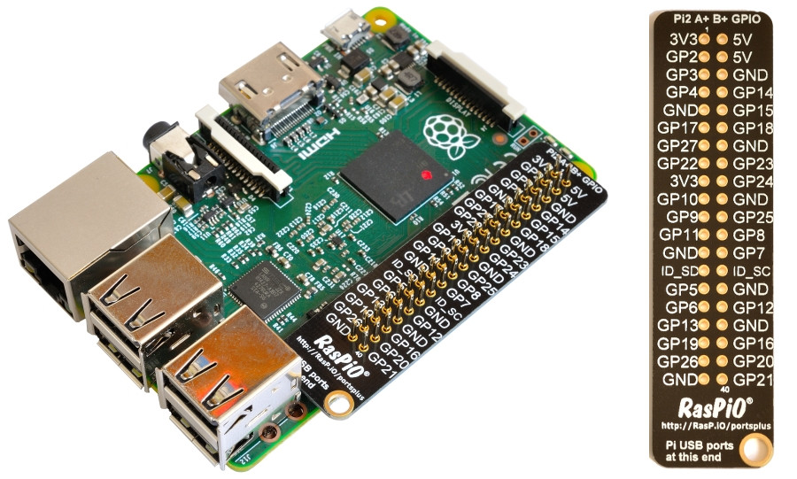

## GPIO pins

One powerful feature of the Raspberry Pi is the row of GPIO pins along the top edge of the board. GPIO stands for General-Purpose Input/Output. These pins are a physical interface between the Raspberry Pi and the outside world. At the simplest level, you can think of them as switches that you can turn on or off (input), or that the Raspberry Pi can turn on or off (output).

The GPIO pins are used to connect the Raspberry Pi to electronic circuits, which allow it to control and monitor the outside world. Using the GPIO pins, the Raspberry Pi is able to turn LEDs on or off, run motors, and perform many other actions. It is also able to detect external conditions, such as temperature, light levels, and whether a switch has been pressed. We refer to this as physical computing.

There are 40 pins on the Raspberry Pi (26 pins on early models), and they provide various different functions.

If you have a RasPiO pin label, it can help to identify what each pin is used for. Make sure your pin label is placed with the keyring hole facing the USB ports, pointed outwards.

If you don't have a pin label, then this guide can help you to identify the pin numbers:

You'll see pins labelled as 3V3, 5V, GND and GP2, GP3, and so on:

|   |   |   |
|---|---|---|
| 3V3 | 3.3 volts | Anything connected to these pins will always receive 3.3V of power |
| 5V | 5 volts | Anything connected to these pins will always receive 5V of power |
| GND | ground | Zero volts, used to complete a circuit |
| GP2 | GPIO pin 2 | These pins are for general-purpose use and can be configured as input or output pins |
| ID_SC/ID_SD/DNC | Special purpose pins ||

**WARNING**: if you follow the instructions, then playing about with the GPIO pins is safe and fun. Randomly plugging wires and power sources into your Raspberry Pi, however, may destroy it, especially if you are using the 5V pins.

